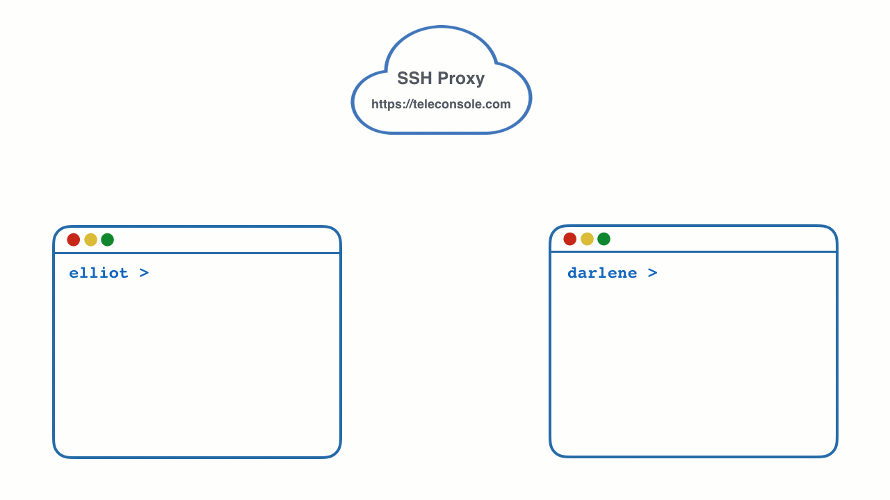

# Teleconsole

[Teleconsole](https://www.teleconsole.com/) is a free service to share your terminal session with people you trust. 
Your friends can join via a command line using SSH or by using their browser. Use it when two parties are separated by NAT
and you cannot connect via SSH directly.

### Installing

Download the latest binaries for your platform [here](https://github.com/gravitational/teleconsole/releases) 
or you can build it from source.

Quick installation for the impatient:

```
curl https://www.teleconsole.com/get.sh | sh
```

### Quick Start

Simply type `./teleconsole` in your terminal and this is what you will see:

```
> teleconsole
Starting local SSH server on localhost...
Requesting a disposable SSH proxy for ekontsevoy...
Checking status of the SSH tunnel...

Your Teleconsole ID: 29382923a870075324233c490831a7
WebUI for this session: https://teleconsole.com/s/29382923a870075324233c490831a7
To stop broadcasting, exit current shell by typing 'exit' or closing the window.
```

Teleconsole will launch a new shell session and print the unique session ID of 
`29382923a870075324233c490831a7` which you need to share with your friend. 
Your friend can join in either by clicking on a link, or by typing: 

```
> teleconsole join 29382923a870075324233c490831a7
```

Now you are both using the same terminal session running on your machine, even if 
both of you are on separate networks separated by NAT.

You can watch a [quick video](https://www.youtube.com/watch?v=R8CnrnquS_s&vq=hd1080&rel=0) 
of how this works. Here's the simplified animation:




### WARNING

Please understand that by running `teleconsole` you are virtually giving the keyboard to
anyone with a link. We made the session IDs sufficiently hard to guess, but **you are still
running an SSH server accessible via public Internet** during the Teleconsole session.


### Ending the Session

When you're done with the session, make sure to close it (stop `teleconsole` process)
either by typing `exit` in the terminal or simply closing it. When Teleconsole exits,
the outbound SSH tunnel is closed and your machine is no longer accessible.

### Port Forwarding

Let's say you are developing a web application and it is currently running on your 
`localhost:5000`. You can make it accessible by your friends if you forward port 
`5000` to them:

```
> teleconsole -f localhost:5000
```

When your friends join this session, they will see something like this:

```
ATTENTION: ekontsevoy has invited you to access port 5000 on their machine via localhost:9000
```

So now your friend can click on `http://localhost:9000` to access your application.

Bear in mind, Teleconsole is just an SSH server, this means your friend can request 
port forwarding without your help, just like a regular SSH client would:

```
> teleconsole -f 9000:localhost:5000 join <session-id>
```

## How does it work?

Teleconsole is built on top of [Gravitational Teleport](http://gravitational.com/teleport) 
which is a clustered SSH server with built-in SSH bastion/proxy. Both projects are 
open source and hosted [here on Github](https://github.com/gravitational/teleport/blob/master/README.md).

What happens when you type `teleconsole`?

1. It generates unique single-use SSH credentials and launches an SSH server on localhost. 
   Then Teleconsole logs into itself, an equivalent of `ssh localhost`.
2. SSH credentials are POSTed via HTTPS to a free anonymous SSH proxy on https://teleconsole.com.
3. The server creates a single-use disposable instance of Teleport SSH proxy, which is 
   trusted by the `teleconsole` SSH server running on your machine. 
4. Your local `teleconsole` SSH server creates an outbound SSH tunnel to the disposable 
   Teleport proxy running on https://teleconsole.com. The proxy now acts as a bridge connecting
   the outside world to your machine.

And here is what happens when you type `teleconsole join session-id`:

<ol start="5">
<li>teleconsole requests the anonymous proxy for SSH key to <code>session-id</code> via HTTPS.</li>
<li>It uses those keys to SSH into the proxy.</li>
<li>The proxy forwards the connection through the tunnel created in step 3 to your machine.</li>
</ol>


### CLI Reference

Typing `teleconsole help` gets you:

```
Usage: teleconsole <flags> <command>

Teleconsole allows you to start a new shell session and invite your 
friends into it.

Simply close the session to stop sharing.

Flags:
   -f host:port  Invite joining parties to connect to host:port
   -L spec       Request port forwarding when joining an existing session
   -insecure     When set, the client will trust invalid SSL certifates
   -v            Verbose logging
   -vv           Extra verbose logging (debug mode)
   -s host:port  Teleconsole server address [teleconsole.com]

Commands:
    help               Print this help
    join [session-id]  Join active session

Examples:
  > teleconsole -f 5000  

    Starts a shared SSH session, also letting joining parties access TCP 
    port 5000 on your machine.

  > teleconsole -f gravitational.com:80

    Starts a shared SSH session, forwarding TCP port 80 to joining parties.
    They will be able to visit http://gravitational.com using your machine
    as a proxy.

  > teleconsole -L 5000:gravitational.com:80 join <session-id>

    Joins the existing session requesting to forward gravitational.com:80
    to local port 5000.

Made by Gravitational Inc http://gravitational.com
```

## Support for Private SSH Bastions

Some people may be uncomfortable using publicly accessible SSH bastion on https://teleconsole.com
They can do the same thing by setting up a [Teleport](http://gravitational.com/teleport) bastion
on their own server. 

In fact, Teleport supports many more features, including session recording and replay, 
`scp` and is compatible with OpenSSH client.

## Roadmap

Before open sourcing it, we have been using Teleconsole with close friends quite a bit. 
So far the top feature requests are:

1. Read-only sessions: this would allow you to broadcast only the picture of your
   terminal. Port forwarding in this mode would be disabled.
2. Ability to see who's viewing your session.
3. Additional password auth per session.

What do **you** think we should add next? Let us know: `info@gravitational.com`

## Who Built Teleconsole?

Teleconsole is an easy to use demo of [Gravitational Teleport](http://gravitational.com/teleport),
a product created by [Gravitational Inc](https://gravitational.com). Teleport is an open source 
component of our commercial offering for deploying and remotely [operating SaaS applications on top of 
3rd party enterprise infrastructure](https://gravitational.com/product). 

For more info, drop us an email: [info@gravitational.com](mailto:info@gravitational.com)
